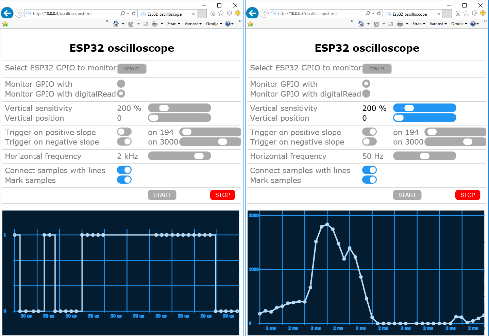

# ESP32 oscilloscope with Web user interface - see the signals the way ESP32 sees them

What is new in this version?
- support for Firefox web browser
- the use of the latest ESP32_ftp_web_telnet_server_template code
- bug fixes

The first picture has been generated by bouncing of an end switch. ESP32 Oscilloscope performed digitalRead-s after pin has been initialized in INPUT_PULLUP mode. The second picture shows noise coming from poorly regulated power supply. ESP32 Oscilloscope used analogRead-s on an unconnected pin.



ESP32 oscilloscope was first meant to be just a demonstration of the ESP32_web_ftp_telnet_server_template (https://github.com/BojanJurca/Esp32_web_ftp_telnet_server_template) capabilities and is still fully included there, but it seems to be
better off on its own. Only functionalities necessary for oscilloscope to work are used:

- **webServer** for HTTP and WS requests (oscilloscope uses WebSockets)

- **ftpServer** for uploading oscilloscope.html to ESP32

## Setup instructions

1. Copy all files in this package into Esp32_oscilloscope directory.
2. Open Esp32_oscilloscope.ino with Arduino IDE.
3. Find and change YOUR-STA-SSID to your WiFi SSID and YOUR-STA-PASSWORD to your WiFi password.
4. Oscilloscope uses FAT file system so select one of FATFS partition schemas (Tools | Partition scheme | ...)
5. Compile sketch and run it on your ESP32 for the first time. Doing this, ESP32 flash memory will be formatted with FAT file system. WARNING: every information you have stored into ESP32’s flash memory will be lost.
6. FTP to your ESP32 (By using ftp command line utility or Windows explorer. User name and password are not required) and upload the following files into /var/www/html directory:

   - android-192.png,
   - apple-180.png,
   - oscilloscope.html.

```
C:\esp32_oscilloscope>ftp YOUR-ESP32-IP
Connected to 10.0.0.3.
220-ESP32 FTP server - everyone is allowed to login
User (10.0.0.3:(none)):
331 enter password
Password:
230 logged on, use "/" to refer to your home directory "/"
ftp> put android-192.png /var/www/html/android-192.png
226 /var/www/html/android-192.png transfer complete
ftp> put apple-180.png /var/www/html/apple-180.png
226 /var/www/html/apple-180.png transfer complete
ftp> put oscilloscope.html /var/www/html/oscilloscope.html
226 /var/www/html/oscilloscope.html transfer complete
ftp> ls
200 port ok
150 starting transfer
-r-xr-xrwx   1 owner    group            1818 Aug 24 10:47      /var/www/html/android-192.png
-r-xr-xrwx   1 owner    group            1596 Aug 24 10:47      /var/www/html/apple-180.png
-r-xr-xrwx   1 owner    group           39515 Aug 24 10:47      /var/www/html/oscilloscope.html
226 transfer complete
ftp>
```

6. Open http://YOUR-ESP32-IP/oscilloscope.html with your browser.
